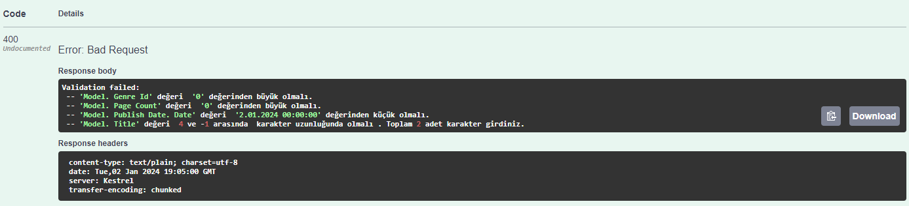
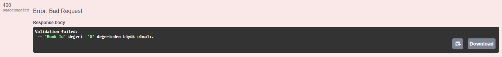
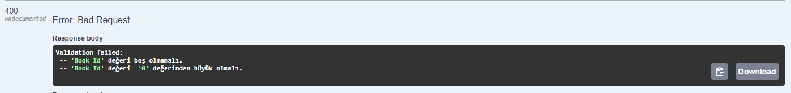
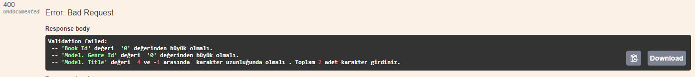
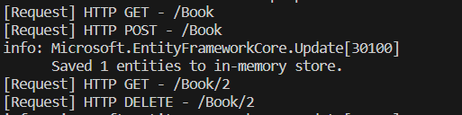
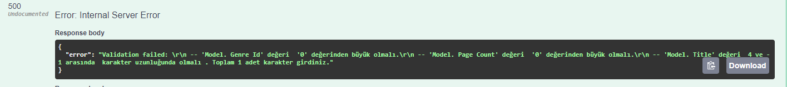

 dotnet add package Microsoft.EntityFrameworkCore --version 7.0.0

 
 dotnet add package Microsoft.EntityFrameworkCore.InMemory --version 7.0.0

#-----Auto mapper------
 dotnet add package AutoMapper --version 7.0.1
 #controllerın constractutuna injection geçebilmek içim
 dotnet add package AutoMapper.Extensions.Microsoft.DependencyInjection --version 7.0.0

 ---Fluent Validation---------------
 dotnet add package FluentValidation --version 7.0.0
 
 Post
 
 Delete
 
 GetbyId
 
 Put (update)
 

 ----Request Loglama---------------

 

 dotnet add package Newtonsoft.Json
